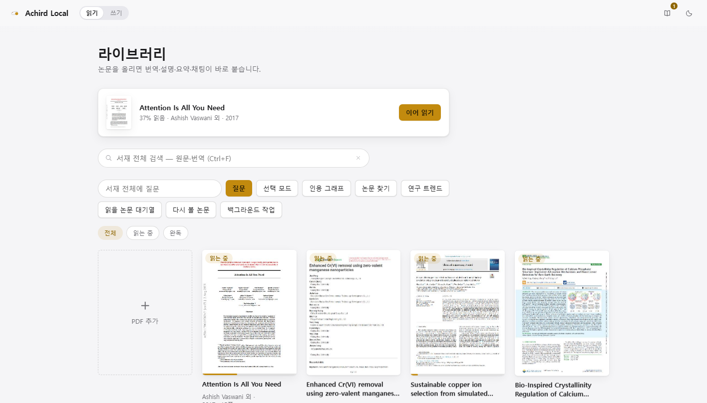
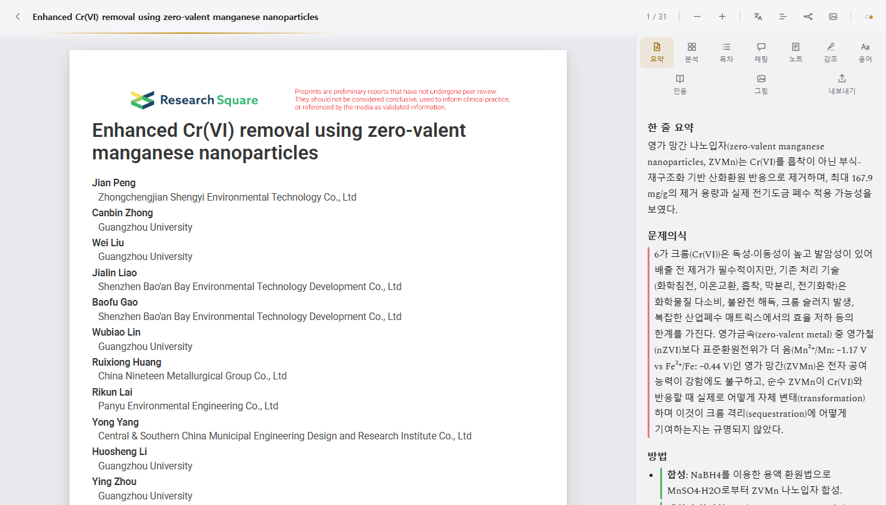
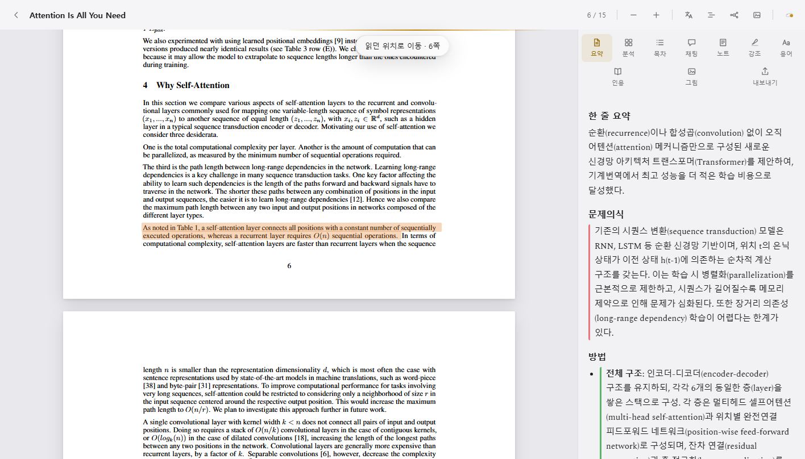

# Achird Local

> Korean: [README.ko.md](README.ko.md)

Achird Local is a local paper-reading and evidence-writing app that recreates the
[themoonlight.io](https://www.themoonlight.io/) reading experience on your own machine
and your own subscription — no API key, no server-side account, your PDFs stay in
`library/` on disk.

It has two tabs. **Read** is for understanding one paper: PDF viewer, auto-generated
summary, structure analysis, mind map, glossary, chat with the paper, citation
verification. **Write** is for pulling evidence out of the whole library into a
section-by-section draft: an evidence board on the left, section drafts on the right,
numbered citations, overlap checking, AI draft scoring, citation integrity checks.

The author (Chaneui Jung, chemical engineering undergraduate, Sogang University, Seoul)
built this with Claude Code over roughly June–August 2026 as a daily research tool,
first for personal paper reading and then for a review-paper writing workflow. This
repository is a snapshot of that tool, published to show how it was built and how it
is used.

## Screenshots


The library shelf — every paper's read/reading/complete status at a glance.


The reader: rendered PDF on the left, auto-generated summary panel on the right.


The same reader open on a different paper, showing the summary panel populated with a full structural breakdown.

## How Claude Code is used in this project

Two separate roles, worth keeping distinct.

**1. As the app's AI runtime.** Every AI call in Achird — summarization, translation,
mind-map generation, citation extraction, draft scoring, flashcard generation — goes
through the Claude Code CLI (`claude -p`) as a subprocess, not the Anthropic API. See
`ask_claude()` in `app.py`. This means the app has no API key and no separate billing:
it reuses whatever Claude Code subscription is already logged in on the machine. The
default model is Sonnet; a few high-volume, low-difficulty jobs (sentence alignment,
bibliography-field extraction, keyword pulling for library search) are pinned to Haiku
to keep them fast. Calls run with `--tools ''` (no tool access — pure text in, text
out) unless the task needs to read an image, in which case `--tools Read` is scoped to
that paper's own folder only.

**2. As the development partner, with a test-first loop.** The app has 232 regression
tests in `tests/test_pure.py`, plain `unittest` from the standard library — no pytest,
no fixtures framework. Three entry points run the same suite: `run_tests.bat`,
`python run_tests.py`, and `python app.py --self-check`. The rule during development
was: after any change to `app.py`, run the tests before considering the change done.
That loop — write a small pure function, add a test for the edge case that motivated
it, run the suite, only then move on — is how a 4,500-line backend and a ~6,500-line
frontend got built and kept working by one person without a formal QA pass. The tests
target pure logic (draft cleaning, citation-key parsing, path rehoming across two
machines, overlap detection, JSON extraction from model output) rather than the FastAPI
routes themselves, which is a deliberate scope choice: fast, deterministic, no network
or subprocess in the hot path.

## Features

Condensed from the full feature list in the Korean README; see [README.ko.md](README.ko.md)
for the complete table.

| Area | What it does |
|---|---|
| Auto-prep chain | On upload or Zotero import: bibliography → summary → 4-color key sentences (novelty/method/result/limitation) → glossary → suggested questions → reference verification, all in the background. "prep n/7" badge per paper. |
| Reading | Lazy-render PDF viewer, mind map where every node points to a source sentence, parallel original/translation view, page translation with a shared glossary, AI explanation of figures and equations, OCR for scanned PDFs. |
| Reference verification | Each reference is resolved via in-text DOI → Crossref → arXiv. Unresolvable entries are marked unverified — never fabricated. |
| Write tab | Evidence board (pulled from highlights/notes/key sentences across the whole library) feeds section drafts. Cursor-position citation insert, numbered-citation export (ACS/APA/BibTeX), overlap check against source text, AI draft scoring with three virtual reviewers, citation-integrity check against the library. |
| Zotero integration | Import PDF + metadata (DOI, authors, year, journal, abstract, citekey) without re-extracting via AI. Import PDF highlights as evidence. Save discovered papers to a running Zotero via the local connector (port 23119). Better BibTeX citekeys used as the canonical key. |
| Obsidian export | Notes with wikilinks, a shared `achird.bib`, incremental ("changed only") re-export, and spaced-repetition flashcards (Q/A pairs generated by Haiku) for papers with highlights or notes. |
| Discovery | OpenAlex-backed "related/citing papers" and topic-based research trends computed from the library's own topic distribution — no manual interest selection. |
| Duplicate detection | sha256 blocks exact re-uploads; DOI/title matching flags near-duplicates (different PDF of the same paper) without blocking the upload. |
| Library search & comparison | Search across original text, translations, notes, highlights, and exported Obsidian notes at once; ask a question over the whole library with cited evidence; compare 2-3 papers side by side. |
| Evidence tables | Select 2-8 papers → generate a target/method/data/result/limitation table, export or copy as Markdown/CSV, revisit saved tables later. |
| Citation graph | Circular layout of citation relationships inside the library, using verified DOIs where available; optional note-derived concept nodes group papers that don't cite each other but share a `[[concept]]`. |
| Reading queue | Papers found via discovery but not yet in the library can be queued; once the PDF is uploaded, the queue entry auto-links to it. |

## Architecture

```
app.py          FastAPI backend + claude -p runner (Sonnet by default, Haiku for simple jobs)
                4,504 lines, single file.
static/         Vanilla-JS single-page frontend, no build step.
  app.js        Main SPA logic (~5,958 lines)
  orbs.js       Background/decorative canvas layer (~548 lines)
  index.html    Shell
  styles.css    Styling (~1,636 lines)
  vendor/       pdf.js 4.8.69, vendored for offline use
library/        Per-paper data on disk (empty in this repo — see below)
tests/          232 pure-function regression tests (stdlib unittest)
run.bat         Launcher: creates a venv, installs deps, opens an app-mode browser window
start-bg.bat    Same, but minimized (for automation) — never hidden, see note below
run_tests.bat   Test runner (= python run_tests.py = python app.py --self-check)
```

`library/` is empty in this repository. The author's own library is a personal PDF
collection and is excluded for copyright reasons; `config.example.json` stands in for
the personal `config.json`.

## Quick start (Windows)

Requirements: Python 3.11+, the `claude` CLI installed and logged in
(`claude` then `/login`).

```
copy config.example.json config.json
run.bat
```

`run.bat` creates a local virtual environment on first run, installs the dependencies
listed in `requirements.txt`, and opens an app-mode browser window at
`http://127.0.0.1:8766`. Run `run.bat --no-browser` for server-only. No API key is
needed — the app calls the `claude` CLI as a subprocess, so it uses whichever Claude
Code subscription is already logged in on the machine.

To verify a change: run `run_tests.bat` (or `python run_tests.py`).

## Design decisions worth noting

- **Write tab is deliberately not a word processor.** No rich formatting, no
  paragraph editing, no AI-generated prose. Achird owns evidence and citations; prose
  is owned by Word, Hangul, or Obsidian. This was a scope cut, not a missing feature —
  see the Korean README's rationale.
- **References are never fabricated.** Verification only marks a reference resolved if
  it actually matched a DOI via Crossref or arXiv; everything else is left as
  unverified rather than guessed.
- **Background automation must not use a hidden window.** `start-bg.bat` runs the
  server minimized, not hidden — `Start-Process -WindowStyle Hidden` on this app
  triggers a Windows Defender `Trojan:Win32/PowhidSubExec` false positive (PowerShell
  + hidden window + child process is a common malware shape). Worth knowing if you
  automate a Python/PowerShell tool the same way.
- **Config path rehoming.** `config.json` lives in the app folder and is synced
  between the author's two machines via OneDrive, but absolute paths (Obsidian vault,
  Zotero data dir) contain a per-machine username. On use, the app rewrites a path with
  a different username back onto the current machine's home directory if the same
  tail path exists there, without touching the stored value — so the other machine
  keeps working too.

## Status and limits

This is a personal research tool published as a snapshot, not a maintained public
project — there is no issue tracker workflow or release cadence attached to it.
`library/`, `docs/audit/`, and `docs/specs/` reflect real day-to-day development notes
and are included for transparency about how the project was actually built, not as
polished documentation.

## License

MIT — see [LICENSE](LICENSE).
